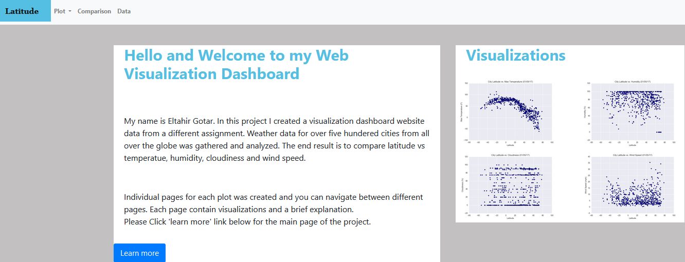
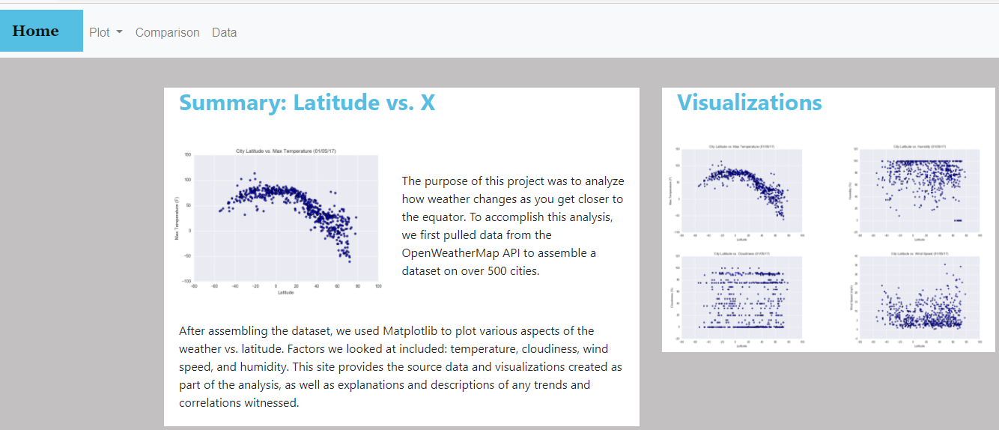
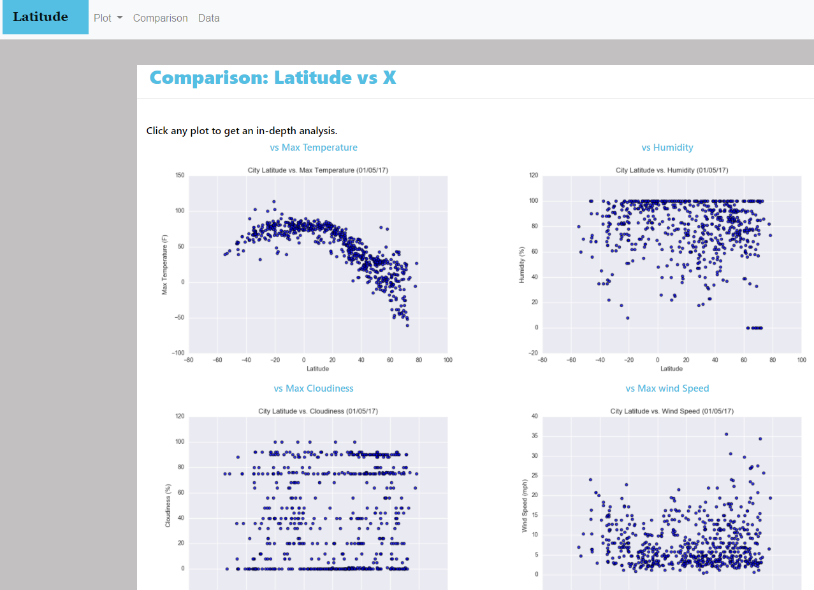
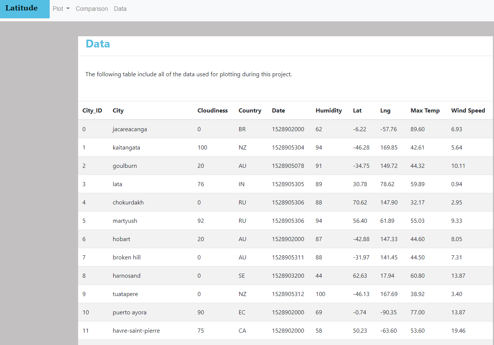
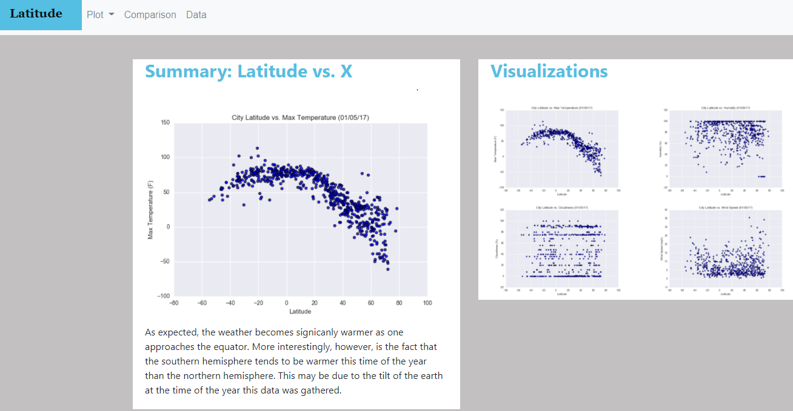

# Web Visualization Dashboard (Latitude)

[https://gotar1.github.io/World-Weather-Analysis/](https://gotar1.github.io/World-Weather-Analysis/)

## Background

Data is more powerful when shared with others! We are going to create a dashboard showing off some analysis we've done in a prior project. Our webpage will be hosted in GitHub pages and can be accessed [Here](https://gotar1.github.io/Web-Design-Challenge/index.html).

 

## Latitude - Latitude Analysis Dashboard with Attitude

We'll be creating a visualization dashboard website using plots we've created in a past project. Specifically, we'll be plotting [weather data](WebVisualizations/Resources/cities.csv) for over 500 cities worldwide.

In building this dashboard, we'll create individual pages for each plot and a means by which we can navigate between them. These pages will contain the visualizations and their corresponding explanations. We'll also have a landing page, a page where we can see a comparison of all of the plots, and another page where we can view the data used to build them.

## Visualization

The website consist of 8 pages total, including:

* An [Index Page](https://gotar1.github.io/Web-Design-Challenge/index.html) containing:
  * An introduction and brief description of the project.
  * Links to each visualizations page with a sidebar containing preview images of each plot. 
* A [landing page](https://gotar1.github.io/Web-Design-Challenge/WebVisualizations/landing.html) containing:
  * An explanation of the project.
  * Links to each visualizations page. Clicking "Home" will take you to Index Page. 
  * Sidebar containing preview images of each plot, and clicking an image  should take the user to that visualization page.
* Four [visualization pages](https://gotar1.github.io/Web-Design-Challenge/WebVisualizations/Visualizations/max_temp.html), each with:
  * A descriptive title and heading tag.
  * The plot/visualization itself for the selected comparison.
  * A paragraph describing the plot and its significance.
  * Links to each visualizations page.
* A ["Comparisons" page](https://gotar1.github.io/Web-Design-Challenge/WebVisualizations/comp.html) that:
  * Contains all of the visualizations on the same page so we can easily visually compare them.
  * Uses a Bootstrap grid for the visualizations.
  * Links to each visualizations page.
* A ["Data" page](https://gotar1.github.io/Web-Design-Challenge/WebVisualizations/data.html) that:
  * Displays a responsive table containing the data used in the visualizations.
    * The table is a bootstrap table component.
    * The table was created by converting the `.csv` file to HTML.

Each page at the top have a navigation menu that:

* Has a button named "Latitude" on the top left which users can click to return to the landing page.
* Contains a dropdown menu named "Plots" that provides a link to each individual visualization page.
* Provides two more text links: "Comparisons," which links to the comparisons page, and "Data," which links to the data page.
* Is responsive (using media queries).

### Screenshots

This section contains screenshots of each page that we built.
#### Index page

#### Landing page

#### Comparisons page

#### Data page

#### Visualization pages

